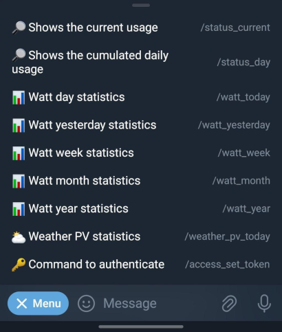
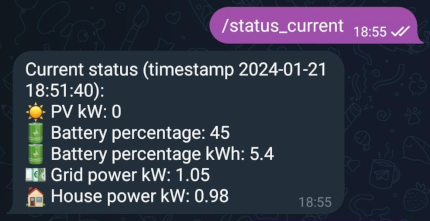
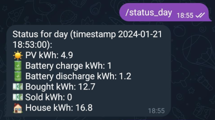
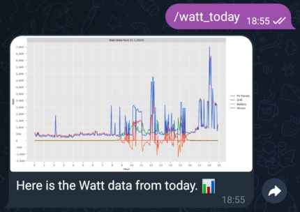
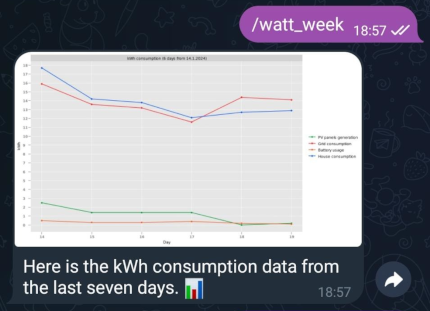
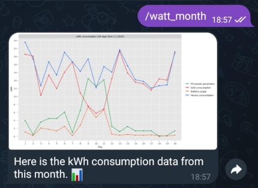
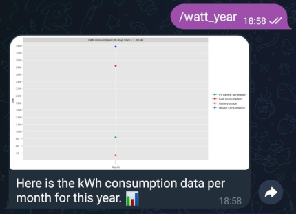
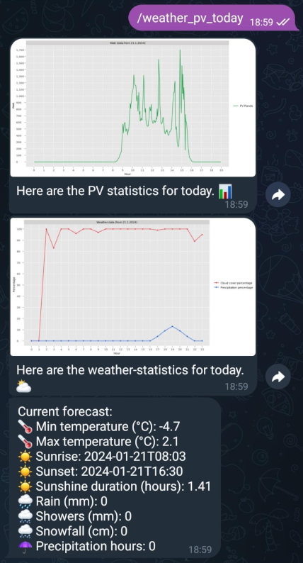
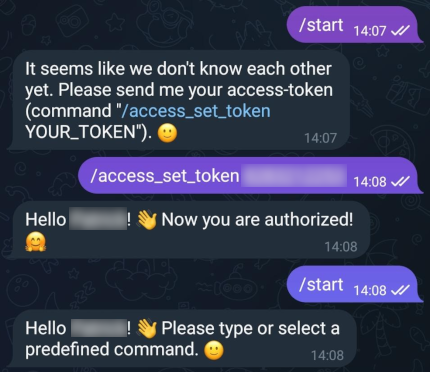
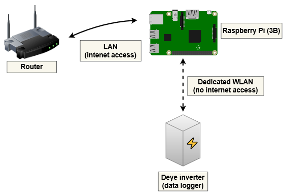

# deye-solarman-telegram-bot project

This repository contains the source code of a Telegram bot project, to read and summarize the data from a Deye 
power inverter. Every inverter with a compatible data-logger should be supported (follow the library links below to 
check if your inverter is compatible).

The goal of this project was to interact with a Deye inverter over a local network, without an internet-connection to 
the official Deye-servers. This prevents the inverter from transmitting unsolicited data and increases privacy.

This project is possible because of these awesome libraries:

[githubDante/deye-controller](https://github.com/githubDante/deye-controller) (used to receive the data from the inverter with [easy-process-interaction](https://github.com/DGS-Development/easy-process-interaction))  
[jmccrohan/pysolarmanv5](https://github.com/jmccrohan/pysolarmanv5) (base-library to interact with the data-logger of the inverter)

# Features 📦

* Fetches and stores the available inverter data at customizable intervals (every 30 seconds by default)
* Enables access to the stored data via the Telegram-bot-API (just create a bot and configure your issued API key) 
* Use of individual components that can be easily customized (e.g. separation between the data, fetch-logic and 
bot-logic)
* Easy setup and configuration (see usage instructions below)

# Supported bot commands 🤖

These commands can be sent to the [BotFather](https://telegram.me/BotFather) as menu-commands (just send the commands 
you want to show).

```
status_current - 🔎 Shows the current usage (now)
status_day - 🔎 Shows the cumulated daily usage
watt_today - 📊 Watt day statistics
watt_yesterday - 📊 Watt yesterday statistics
watt_week - 📊 Watt week statistics
watt_month - 📊 Watt month statistics
watt_year - 📊 Watt year statistics
weather_pv_today - ⛅️ Weather PV statistics 
access_set_token - 🔑 Command to authenticate
```

Result (if all commands were set):



## Status commands 🔎

### status_current

Shows the current usage data from the last available measurement. This includes the produced energy for all panels, 
the battery status, how much is bought from the grid and how much the house consumes.



### status_day

Shows the total usage data for the current day. This includes the produced energy from all panels, the battery status 
(charge and discharge), how much energy was bought from and sold to the grid and how much the house consumed.



## Watt statistics commands 📊

### watt_day

Shows the watt usage data for the current day.



### watt_week

Shows the watt usage data for the last seven days for the current month (the time span of a week).



### watt_month

Shows the watt usage data for this month (first day to current day).



### watt_year

Shows the watt usage data for every month of the current year (cumulated values).



## Special commands

### weather_pv_today

Shows the produced energy for all panels for the current day. In addition, the current weather data is retrieved and
displayed.



### start

The default "/start" command that is executed if the chat is started for the first time. 

If the user isn't authenticated yet a welcome-message is returned, which request an authentication (see the command 
below). If the user is already authenticated a generic welcome-message is returned.

### access_set_token

The command to authorize the chat-user to allow all other bot-commands (beside "/start"). The access-token can be 
set through the configuration (see usage instructions).

Example:



# Usage 📖

The following sections describe how to use the bot-project.

## Requirements

It is possible to run the bot-project on any target-device that supports the installation of a recent Java-JRE 
(>= Java 21) and Python 3 (to install [githubDante/deye-controller](https://github.com/githubDante/deye-controller)). 
The only other requirement is to create a network which has access to the internet (LAN or WLAN) and a second network 
which has no access to the internet, to which the Deye inverter connects to (WLAN). The bot-service must have 
access to both networks.

The following components were used:

- Raspberry PI 3B (target-device to host the Java bot-service and provide a dedicated network for the Deye inverter)
- [DietPI](https://dietpi.com/) installation (as minimal Raspberry OS)
- [Liberica JRE](https://u--labs-de.translate.goog/portal/aktuelles-java-17-11-und-weitere-ueber-die-paketverwaltung-mit-liberica-jdk-auf-dem-raspberry-pi-und-x86-linux-systemen-installieren/?_x_tr_sl=auto&_x_tr_tl=en&_x_tr_hl=de&_x_tr_pto=wapp) (it is required to add a Bellsoft repository)
- Python 3 (default package, already in default-repository)
- [githubDante/deye-controller](https://github.com/githubDante/deye-controller) (installation after Python 3)

Overview (icons from Openclipart and diagrams.net):



## Setup

The following steps must be followed after the target-device requirements are fulfilled (including the installation of 
Java and "deye-controller").

### Compile the project to generate a JAR file

1. Download the repository source code

```bash
git clone https://github.com/zeront4e/deye-solarman-telegram-bot.git
```

2. Enter the created directory

```bash
cd deye-solarman-telegram-bot
```

3. Build the project (Maven and a Java JDK (>= 21) is required)

```bash
mvn clean install
```

After the last command was executed, there should be an executable JAR file in the created "target" directory 
(file "deye-solarman-telegram-bot-1.0.0-SNAPSHOT-shaded.jar").

### Copy the JAR file to a dedicated directory of the target device

In the test project, the JAR file was copied to the home directory of the user "piuser" 
(path "/home/piuser/dstb/deye-solarman-telegram-bot-1.0.0-SNAPSHOT-shaded.jar"). The user is a regular user without 
root-permissions.

### Create a configuration-file beside the copied JAR file

Path of the test configuration file: "/home/piuser/dstb/app.properties"

Example configuration file with defaults:

```properties
#The database prefix to use when the database file is stored (e.g. "data.h2" causes the creation of the file 
#"data.h2.mv.db").
databaseFilePrefix=data.h2

#The temporary directory where the fetched JSON data, from the Deye data-logger, is stored.
deyeTmpDataDirectoryPath=deye-tmp-data

#The IP address of the Deye data-logger.
deyeLoggerIp=192.168.42.10

#The serial number of the Deye data-logger.
deyeLoggerSerialNumber=123456789

#The minimum interval between a successful fetch and a fetch-try.
deyeLoggerFetchIntervalSeconds=60

#The minimum interval between a failed fetch and a fetch-retry.
schedulerLoggerFetchTryIntervalSeconds=10

#The hour when the daily statistics should be stored.
schedulerLoggerDailyMeasurementsSaveHour=23

#The minute when the daily statistics should be stored.
schedulerLoggerDailyMeasurementsSaveMinute=50

#The API key for the created Telegram bot (the key is issued by the BotFather bot).
telegramUserInteractionBotApiKey=xxxxxxxxxx:xxxxxxxxxxxxxxxxxxxxxxxxxxxxxxxxxxx

#The access token, required to interact with the Telegram bot.
#Leave empty to automatically block all access by default!
telegramUserInteractionBotAccessToken=

#The URL to fetch weather-data from (data from "open-meteo.com", with a daily forecast for the given coordinates).
#Change the values for "latitude", "longitude" and "timezone" according to your location.
weatherApiJsonDataGetUrl=https://api.open-meteo.com/v1/forecast?latitude=52.5243&longitude=13.4105&hourly=temperature_2m,relative_humidity_2m,precipitation_probability,precipitation,cloud_cover,visibility&daily=weather_code,temperature_2m_max,temperature_2m_min,sunrise,sunset,sunshine_duration,precipitation_sum,rain_sum,showers_sum,snowfall_sum,precipitation_hours,precipitation_probability_max&timezone=Europe%2FBerlin&forecast_days=1

#The interval between fetch-requests to the weather API.
weatherApiRefreshIntervalMinutes=3
```

### Create a service description file (systemd)

The following service description file was created to automatically manage the bot-service with systemd.

Note that it is important to make the [deye-controller](https://github.com/githubDante/deye-controller) command 
"deye-read" globally available, by setting the environment-variable "PATH".

Service description (file "/etc/systemd/system/dstb.service"):

```properties
[Unit]
Description=deye-solarman-telegram-bot service
After=syslog.target network.target

[Service]
SuccessExitStatus=143

#The deye-controller python-scripts are stored here, to contact the data-logger.
Environment=PATH=/home/piuser/.local/bin

User=piuser
Group=piuser

Type=simple

WorkingDirectory=/home/piuser/dstb
ExecStart=/usr/bin/java -jar deye-solarman-telegram-bot-1.0.0-SNAPSHOT-shaded.jar
ExecStop=/bin/kill -15 $MAINPID

#Always restart the service after 6 hours (the time interval to write the RAM data to the single-file database).
RuntimeMaxSec=21600s
Restart=always

[Install]
WantedBy=multi-user.target
```

### Start the bot-service

It should be possible to manage the bot-service with the following commands, after all configuration files were created.

Start the service:

```bash
sudo systemctl start dstb.service
```

Show the status of the service (including the latest logs):

```bash
sudo systemctl status dstb.service
```

Stop the service:

```bash
sudo systemctl stop dstb.service
```